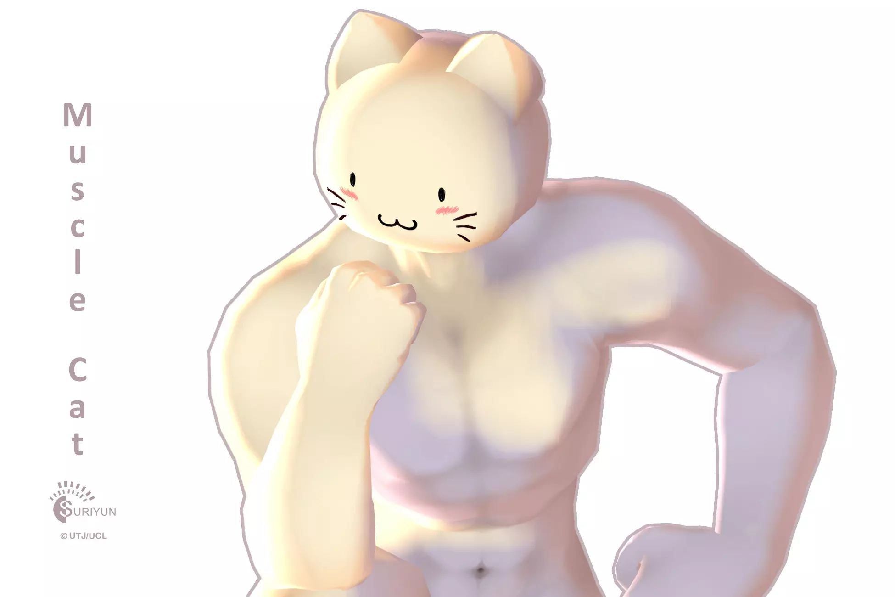

https://youtu.be/iI7-nLKw66g?si=EF3uSIPFEUBi0NPJ
https://www.youtube.com/shorts/a0lXYs1CupI

## 공격 및 스킬
### 기본공격 : 마우스 좌클릭

근접 맨주먹을 휘두르는 공격. 4타로 구성되어 있다.

### 특수행동 : Shift

약한 공격을 막는 가드상태가 된다.

가드 상태에서 피격시 궁극기 게이지가 충전된다.

### 기본스킬1 : E키

전방으로 점프하며 착지시 충격파를 발생시켜 주변 적들에게 데미지를 준다.

### 기본스킬2 : R키

연속적으로 펀치를 날려 주변의 적들에게 데미지를 입힌다.

### 궁극스킬 : Q키

주먹에 힘을 모아 강력한 펀치를 날린다.

..

## 모델링

