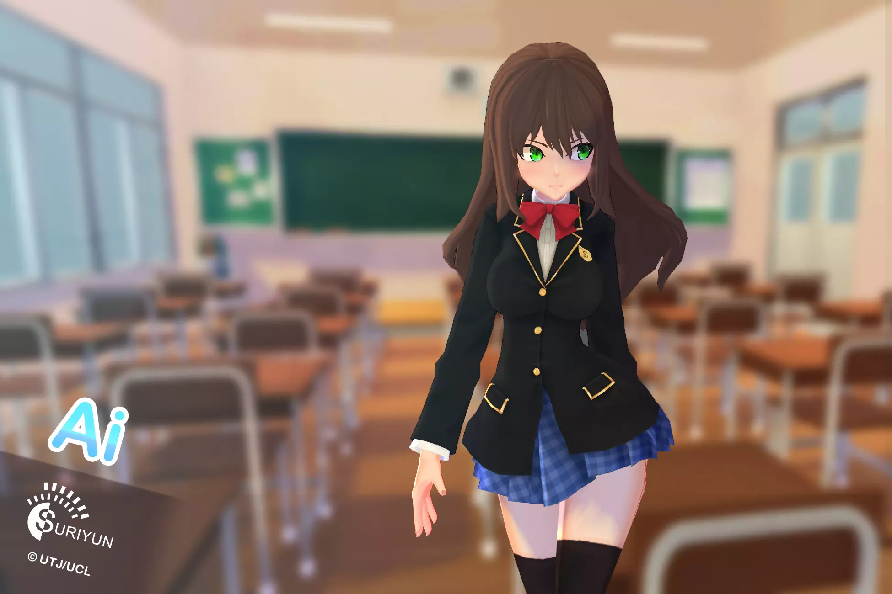

## 공격 및 스킬
### 기본공격 : 마우스 좌클릭

활로 공격하는 장거리 타입. 마우스를 누르고 있으면 조준하고, 마우스를 떼면 화살을 발사한다. 차징 시간에 따라 공격력과 화살의 이동거리가 증가한다. 원거리를 책임지는 캐릭터

### 기본스킬 : E키

불속성 기술로 나무상자를 태우거나 무언가를 폭발시킬 수 있음

### 궁극스킬 : Q키

..

