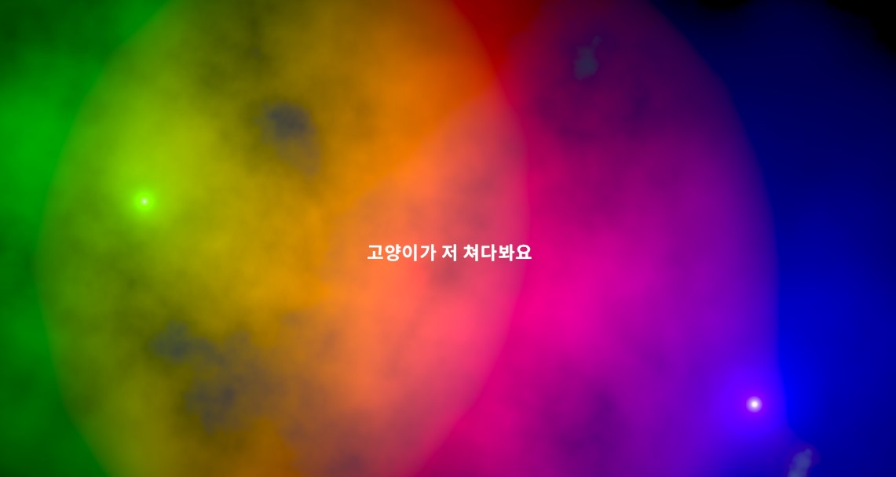

# 글로벌 UI (공통 UI)
모든 씬에서 공통적으로 사용할 수 있는 UI 기능 모음

해당 기능들은 싱글톤인 'UIManager' 클래스에 접근하여 사용하실 수 있습니다.

## 1. 로딩신 UI

로딩씬에서 사용하는 UI입니다.

가운데 멘트는 랜덤으로 나옵니다.

## 2. 캐릭터 컷씬 UI

캐릭터의 궁극 스킬을 사용하는 등, 캐릭터 컷씬 출력을 위한 UI.

## 3. 딤드 UI

유저의 상호작용을 막기 위한 검은색 반투명 UI를 활성화시킵니다. 
이 UI는 화면의 전체를 꽉 채웁니다.

## 4. 팝업 UI

유저의 확인이 필요한 중요한 정보를 전송하기 위한 UI를 출력할 때 사용합니다.

팝업 UI출력시 백그라운드에는 딤드 UI가 활성화 되어있으며, 유저가 확인 혹은 취소 버튼을 눌러야 팝업 UI가 사라집니다.

팝업의 종류에는 Ok와 OkCancle이 있으며, Ok에는 확인 버튼만 있으며, OkCancle에서는 확인 취소 버튼이 둘 다 존재합니다. 팝업 UI 활성화시 각 버튼에 특수한 이벤트를 추가하여 해당 버튼을 클릭시 해당 이벤트를 실행하게 할 수 있습니다.

## 5. 토스트 메시지

토스트 메시지의 특정 텍스트를 유저에게 가볍게 보여주는 경우 사용합니다. 유저와의 상호작용이 없고, 유저가 메시지를 무시하더라도 큰 문제가 없는 경우 사용됩니다.

토스트 메시지는 4개의 타입으로 구성. 타입 별로 고유의 색상을 가지고 있음.

- 기본: 회색톤 배경, 유저 플레이와 연관 없는 메시지를 출력할 때 사용. (예: "크아아아아" 드래곤중에서도 최강의 투명드래곤이 울부짓었다) 
- 안내: 하늘색톤 배경, 유저에게 게임플레이에 대한 팁을 가볍게 알려줄 때 주로 사용 (예: A키를 누르면 A키가 입력됩니다) 
- 경고: 노란톤 배경, 유저 플레이에 영향이 있는 상황이 생기기 직전에 안내해주는 개념. (예: 장비 내구도가 부족합니다, 이것을 사용하려면 저것을 해야할것입니다.) 
- 중요: 빨간톤 배경, 유저 플레이에 영향이 생기거나 할 수 없는 행위를 하려는 경우 출력. (예: 장비가 파괴되었습니다, 이것을 하지 않아서 저것을 할 수 없습니다.) 

## 6. 로딩 UI

로딩씬 UI와 달리, 씬 이동 없이 일시적으로 무언가를 대기하며, 대기 시간동안 유저의 입력을 막아야 하는 경우 사용하는 UI입니다.
