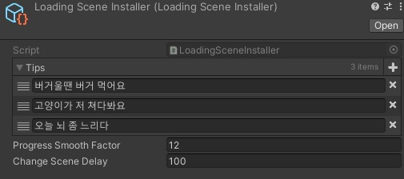

# LoadingSceneInstaller

로딩씬에서 출력되는 랜덤 팁 텍스트와 프로그래스 바 셋팅을 위한 ScriptableObject

- Tips: 랜덤으로 출력될 팁 텍스트가 담긴 리스트. 이 중 한개의 팁이 랜덤으로 출력된다.
- Progress Smooth Factor: deltaTime과 곱해져 ProgressBar를 부드럽게 표현하기 위한 Lerp의 인자로 사용된다.
- Change Scene Delay: 로딩씬과 새로 로드할 씬 사이에 사용되는 딜레이(ms단위) 시간이다.
